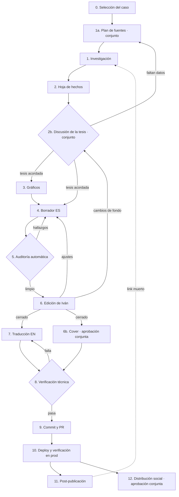

# Flujo de producción de contenido del portfolio

Cada nodo tiene: qué entra y qué sale, sus reglas (cada una atada a la falla real que
la motivó, ver el registro al final), quién revisa, y qué herramienta lo hace cumplir.
La regla general del flujo: **lo objetivo lo frena una máquina, lo editorial lo decide
Iván, y Claude propone en el medio.**

---

## Nodo 0 · Selección del caso

**Entra:** una idea, una empresa, un dataset o una entrevista en el horizonte.
**Sale:** decisión de colección (`projects` vs `posts`), `kind`, slug, y el ángulo.

Reglas:

1. La empresa anfitriona del caso es un target de contratación. Se elige por
   empleabilidad y visibilidad, nunca filtrando por si la empresa "cae bien".
2. El caso tiene que mostrar criterio de producto en primer plano; la profundidad
   técnica es evidencia de soporte, no el titular.
3. Un caso sobre una empresa real es consejo no pedido: el estándar de rigor sube,
   no baja. Si no se puede sostener cada número, se elige otro ángulo.
4. **El relato de proceso no se publica.** Ni en el caso (regla 4.7) ni como
   "making-of" en el blog: contar tesis descartadas o errores atrapados le pide
   generosidad al lector y puede leerse como debilidad en vez de rigor
   (decisión de Iván, 2026-08-03, tras descartar una pieza ya escrita). El
   aprendizaje de proceso queda en el registro de fallas de este documento. El
   blog sigue existiendo para piezas personales de otra índole.
5. Vía corta de posts: saltean los nodos 1-3 y van 0 → 4 → 6 → 7 → 8. Condición:
   toda cifra de un post sale de la hoja commiteada de un caso, referenciada con el
   puntero `{/* facts: ... */}` en el cuerpo; sin puntero, el auditor trata cada
   cifra como inventada hasta demostrar lo contrario. Las reglas de voz aplican
   igual.

**Revisa:** Iván. Es la única decisión 100% suya del flujo.
**Herramienta:** `/new-case` scaffoldea las dos carpetas con el frontmatter válido.

## Nodo 1a · Plan de fuentes (conjunto)

**Entra:** el ángulo del nodo 0. **Sale:** un plan de dónde buscar, acordado con Iván
antes de gastar horas de investigación.

Qué fuentes existen depende del caso, y el plan se arma **juntos**: Claude releva qué
hay disponible, Iván decide qué vale la pena. El menú a recorrer, siempre:

1. **Datos abiertos y oficiales** (SSN, SRT, INDEC, reguladores del país que toque).
   Cuando existen, mandan: son la columna vertebral de un caso tipo "La prima que
   no llega".
2. **Informes de mercado y estadísticas sectoriales** (cámaras, consultoras,
   informes anuales de la industria).
3. **Fuentes corporativas**: resultados, comunicados, investor relations, páginas
   de producto de los jugadores.
4. **Prensa de negocios**, para hechos (rondas, acuerdos, lanzamientos), no para
   cifras recalculables.
5. **Trabajo de campo propio**: entrevistas, relevamiento de producto en primera
   persona, benchmarks de otros mercados. Es la fuente más cara y la única que
   nadie más tiene; cuándo la pagamos se decide acá.

Reglas:

1. Para cada fuente candidata, el plan dice qué pregunta del caso responde y qué
   valor agrega. Una fuente que no responde nada no entra por completismo.
2. Mientras más información, mejor: el techo lo pone la disponibilidad, no la
   pereza. Si una clase de fuente no existe para este caso, el plan lo deja
   escrito (que la limitación quede declarada, no descubierta tarde).
3. El plan es revisable: si el nodo 2b muestra que falta evidencia, se vuelve acá
   y se amplía, no se estira lo que hay.

**Revisa:** Iván aprueba el plan antes de ejecutarlo.

## Nodo 1 · Investigación

**Entra:** el plan de fuentes aprobado. **Sale:** hallazgos con fuente, cada uno etiquetado.

Reglas:

1. **Fuentes primarias antes que prensa.** Balances SSN, anexos estadísticos,
   comunicados oficiales. La prensa sirve para hechos de negocio (rondas, acuerdos),
   no para cifras que se puedan calcular de la fuente.
2. Todo número recalculable se recalcula. Si el resultado difiere del publicado, se
   prioriza el publicado y se explica la diferencia; nunca se reemplaza el dato
   oficial por la cuenta propia sin decirlo.
3. Ninguna cifra sale de la memoria del modelo. Lo que no se encontró en una fuente
   esta semana, no existe.
4. Las versiones periodísticas sin confirmar se etiquetan como tales y no sostienen
   ninguna conclusión.
5. Antes de publicar una crítica a un producto ajeno ("X está roto"), reproducirla
   con un input de otra toolchain.
6. Al citar una nota, **leerla entera**, no solo el titular: el hallazgo de que
   Mercado Pago arrancó por celular estaba en el cuerpo de una nota citada para
   otra cosa.

**Revisa:** Claude triangula; Iván desafía ("¿de dónde sale este número?").
**Herramienta:** WebSearch/WebFetch. Los datasets crudos (CSV de balances, XLSX)
se guardan en `data/<slug>/` (ignorado por git, sobrevive a la sesión); su URL de
descarga queda en el `facts.md` del caso, así el auditor puede re-descargar y
re-correr. Los cálculos quedan reproducibles como script, no como número suelto.

## Nodo 2 · Hoja de hechos

**Entra:** los hallazgos del nodo 1. **Sale:** `facts_<caso>.md`, la única fuente de
verdad del caso. Ningún número entra al artículo sin estar acá primero.

Reglas:

1. Cada dato lleva: valor exacto, estatus (`dato publicado` / `cálculo propio sobre
fuente oficial` / `versión periodística` / `hipótesis del modelo`) y fuente.
2. Los redondeos permitidos se declaran explícitos con la convención `45,6% ≈ 46%`.
   Un redondeo no declarado es un hallazgo de auditoría.
3. Las hipótesis del modelo llevan la fórmula, no solo el resultado, para que el
   lector (y el auditor) puedan recalcular con otro input.
4. La hoja incluye la sección de prohibiciones de voz, así el auditor la recibe
   junto con los datos.
5. Datos que dependen de fecha (topes en pesos, franquicias) llevan su fecha de
   relevamiento y se citan fechados en el artículo.
6. Todo "cálculo propio sobre fuente oficial" entra a la hoja con su script
   commiteado y la URL de descarga del dataset crudo; el auditor del nodo 5 lo
   re-ejecuta y compara. Todo "dato publicado" lleva la cita textual, para que sea
   greppeable contra la fuente. Un cálculo irreproducible es un número suelto.

**Revisa:** nadie todavía; la hoja ES el instrumento de revisión de los nodos 4-5.
**Herramienta:** vive en `content/<colección>/es/<slug>/facts.md`, versionada junto
al caso. Velite solo levanta `*.mdx`, así que no se publica, pero el auditor y las
sesiones futuras siempre la encuentran.

## Nodo 2b · Discusión de la tesis (conjunto)

**Entra:** la hoja de hechos con TODA la información disponible ya analizada.
**Sale:** la tesis acordada, o la vuelta al nodo 1a por más evidencia.

Este es el gate que la falla #1 del registro compró: la primera tesis del caso
Nubank se escribió antes de mirar los datos y murió al verificarlos. El orden
correcto es datos → tesis, nunca al revés.

Reglas:

1. **No se escribe ni un párrafo del borrador ni se dibuja un gráfico antes de
   acordar la tesis.** Los gráficos argumentan una tesis; sin tesis acordada son
   decoración que después hay que tirar (g1 y g2 lo probaron).
2. Claude presenta los hallazgos organizados en tres pilas: qué refuerza cada
   tesis candidata, qué la debilita, y qué no se pudo saber. La pila del medio se
   presenta con el mismo detalle que la primera: la evidencia incómoda destacada
   acá es la que después sostiene el artículo.
3. Cada tesis candidata se enuncia con su condición de muerte ("qué me haría
   cambiar de opinión") ya pensada. Una tesis sin condición de muerte no compite.
4. La discusión es con datos sobre la mesa: cada afirmación del debate traza a la
   hoja de hechos. "Me parece que" no cierra el gate.
5. La tesis final la decide Iván. Claude recomienda una y dice por qué.

**Revisa:** Iván y Claude juntos; es el segundo de los dos gates conjuntos del
flujo, y el más barato de los dos de repetir si hace falta.

## Nodo 3 · Gráficos

**Entra:** hoja de hechos + tesis acordada en 2b. **Sale:** PNGs en
`public/projects/<slug>/` + script generador.

Reglas:

1. **Un gráfico solo puede mostrar datos de la hoja de hechos.** Si muestra una
   proyección, el título lo dice ("mi modelo proyecta"), nunca en pasado como si
   fuera un resultado.
2. Metodología inventada es falta grave: un "n = 8.000" decorativo mata la
   credibilidad de toda la pieza. Si no hay campo, no hay n.
3. El pie de cada gráfico dice qué es dato y qué es elaboración propia, y sobre qué
   fuente.
4. Todo gráfico sale de un script versionado en `scripts/charts/<slug>.py`, nunca
   de una imagen editada a mano: regenerable = auditable. Verificado con el caso
   Nubank: la regeneración da PNGs byte-idénticos.
5. Consistencia visual: la especificación viva son las constantes del script
   commiteado (`scripts/charts/nubank-seguros-argentina.py`: FG #111111, GRAY
   #8a8a8a, BG #f8f9fa, DejaVu Sans, título bold ~24pt a la izquierda, footer de
   atribución 13pt abajo a la izquierda). Un caso nuevo copia esas constantes.
6. Un insight declarado sobre un gráfico se verifica aritméticamente contra sus
   propios datos antes de escribirlo (el "la base domina" de g4 estaba invertido
   tal como estaba dibujado).
7. Presupuesto de peso: un asset inline o un PNG no puede pesar un orden de
   magnitud más que sus pares sin justificación.

**Revisa:** Claude mira el PNG renderizado (no solo el código) antes de referenciarlo.
**Herramienta:** el hook valida existencia, alt y dimensiones declaradas vs reales
sobre el divisor entero (retina 2x pasa; un off-by-one de 1px falla), y avisa si un
asset pesa más de 5x la mediana de sus pares.

## Nodo 4 · Borrador ES

**Entra:** hoja de hechos + tesis acordada + gráficos. **Sale:** `index.mdx` en
`content/<col>/es/`.

Reglas de contenido:

1. Tesis primero: la conclusión está en el primer bloque, no al final.
2. Todo número modelado lleva "mi modelo" o "mi hipótesis" **en la misma oración**.
3. La evidencia contraria a la tesis va destacada, no escondida (el `Thesis` de
   "ni la propia Nubank hace deducible bajo").
4. Sección fija "Qué es dato y qué es supuesto" con la tabla de trazabilidad, y una
   sección de límites o "Qué me haría cambiar de opinión".
5. Disclaimer de no afiliación, una vez, discreto.
6. Los experimentos propuestos llevan criterio de kill fijado a priori.
7. **El caso presenta la tesis final, nunca el camino de descarte.** Nada de "mi
   premisa original era..." ni "el hallazgo que me hizo cambiar de opinión": el
   gate 2b existe justamente para que la tesis llegue al borrador ya filtrada
   por los datos, y narrarle al lector una tesis muerta debilita la vigente. El
   relato de proceso no se publica en ningún formato (regla 0.4): queda en el
   registro de fallas interno.

Reglas de voz (fuente de verdad: `.claude/docs/voice-rules.md`; el lint hace
cumplir como WARN la 8 y parcialmente la 7, 9 y 10 con los patrones listados en
`lint-content.mjs`; las variantes de la 9, los remates de la 10 y las 11-12 las
posee el auditor del nodo 5):

7. Español rioplatense, voseo. Sin tuteo peninsular.
8. Prohibido el guion largo (—) como puntuación.
9. "No es X. Es Y." máximo una vez por pieza, contando variantes con otros verbos.
10. Sin adjetivos infladores sin dato, sin lenguaje de aspirante, sin arranques
    genéricos. Máximo dos remates aforísticos por pieza.
11. Sin jerga innecesaria en castellano ("gates abiertos" → "pendientes").
12. Nada de duraciones o cifras inventadas ni siquiera en piezas personales: si no
    se midió, no se afirma.

**Revisa:** el hook en cada guardado (mismo turno); después el nodo 5.
**Herramienta:** hook `PostToolUse` → `lint-content.mjs`.

## Nodo 5 · Auditoría automática

**Entra:** borrador + hoja de hechos. **Sale:** hallazgos con severidad, o luz verde.

Reglas:

1. La auditoría de trazabilidad cruza **todo** número del artículo (incluido el
   frontmatter) contra la hoja: valor exacto, estatus, y "mi modelo" en la oración.
2. Cada hallazgo se verifica adversarialmente antes de reportarse: la cita tiene
   que existir textual y la regla tiene que decir lo que el auditor afirma. Mejor
   cinco hallazgos sólidos que quince con ruido.
3. La aritmética interna se recomprueba (porcentajes contra totales, funnels).
4. Lo que la auditoría no puede ver: si la tesis es buena. Eso es del nodo 6.

**Revisa:** agente `content-auditor`. Se invoca con la ruta absoluta del
`index.mdx`; el agente encuentra solo la hoja (`facts.md` junto al MDX o el puntero
`{/* facts: ... */}` de un post) y las reglas de voz versionadas. "Limpio" significa:
cero hallazgos de severidad alta tras aplicar los confirmados y re-correr. Su input
incluye el script de gráficos del caso: el texto pintado dentro de un PNG solo lo
puede auditar él.
**Herramienta:** `.claude/agents/content-auditor.md`, invocado por `/content-check`
paso 0.

## Nodo 6 · Edición de Iván

**Entra:** borrador auditado. **Sale:** ES cerrado, o vuelta atrás.

Reglas:

1. Es la única puerta a la traducción: **la EN no se empieza hasta que la ES está
   cerrada**, para no aplicar cada corrección dos veces.
2. Las preguntas de Iván del estilo "¿qué credibilidad tiene esto?" o "¿qué ve un
   manager acá?" no son objeciones de estilo: son la revisión de fondo. Si una
   sección no la sobrevive, se vuelve al nodo 1, no se parchea la prosa.
3. Iván pisa los links que sostienen afirmaciones centrales de la tesis y verifica
   que la página siga diciendo lo que se cita. El 404 y la redirección a la home ya
   son del script (`check-links.mjs` los detecta desde que esa clase de error
   apareció); lo que sigue siendo humano es el contenido detrás del link.

**Revisa:** Iván. Claude no defiende el texto: responde con evidencia y, si no la
hay, corta lo que no se sostiene.

## Nodo 6b · Cover (conjunto)

**Entra:** el ES cerrado. **Sale:** `cover.jpg` junto al MDX, con su `alt`.

La cover se genera con la IA de imágenes de Google desde un prompt que Claude
redacta y se aprueba junto con Iván; la generación la corre Iván con su cuenta.
Corre en paralelo con la traducción (nodo 7).

Reglas:

1. El prompt sigue la anatomía de 7 bloques de `.claude/docs/cover-style.md`
   (estilo, paleta, composición, metáfora en dos estructuras, figura humana,
   luz y mood, prohibiciones y formato). Los bloques 1, 2, 3 y 7 son fijos entre
   casos: son la identidad visual de la serie.
2. La metáfora (bloque 4) nace del escrito cerrado, nunca del título: la tesis
   traducida a objetos físicos, sin pantallas, logos ni nada literal. El objeto
   que brilla en ámbar es el protagonista conceptual del caso.
3. La frase de mood (bloque 6) es el tagline del caso traducido a atmósfera, y
   se escribe a medida.
4. Iteración dirigida: si la imagen sale con texto, simetría o cliché, se ajusta
   el bloque responsable del prompt, no se regenera a ciegas.
5. La imagen queda como `cover.jpg` al lado del `index.mdx` (Velite genera el
   placeholder) con un `alt` que describe la escena completa. Recién con la
   cover puesta el caso puede ser `featured: true` (lo exigen Velite y el lint).

**Revisa:** aprobación conjunta del prompt; la imagen final la elige Iván.
**Herramienta:** `.claude/docs/cover-style.md`, con el prompt canónico de
cobranza-seguros como referencia verbatim.

## Nodo 7 · Traducción EN

**Entra:** ES cerrado. **Sale:** `index.mdx` en `content/<col>/en/`.

Reglas:

1. Misma hoja de hechos; los números no se re-traducen, se re-verifican (formato
   de miles y decimales cambia: `$228,3 mil M` → `$228.3B ARS`).
2. Los labels de métricas EN: presupuesto ~35 caracteres, describir el filtro y
   cortar. El criterio final es visual y lo cierra `/content-check` paso 6
   (screenshot de las cards a 375px: máximo 3 líneas, sin palabras huérfanas).
3. `translationKey` idéntico; el frontmatter EN respeta sus propios límites.
4. El inglés se mantiene simple: el autor tiene A2 y el texto no debe fingir un
   nivel que no tiene en una entrevista.

**Revisa:** lint + una pasada de Iván más liviana que la del nodo 6.

## Nodo 8 · Verificación técnica

**Entra:** ES + EN + assets. **Sale:** luz verde para commitear.

La secuencia completa vive en el skill `/content-check` y es orden-dependiente:
lint → velite → prettier/typecheck/lint → **links externos** → build de producción →
render real (ambos locales, consola limpia, `/_next/image` sirviendo WebP, sin
overflow horizontal en 375px).

Reglas:

1. No se saltea ningún paso; si uno falla se arregla y se repite desde ese paso.
2. El paso de links frena solo por URLs citadas en la pieza que se publica
   (`check-links.mjs` acepta paths); los del resto del corpus son del cron (11.1).
   Un link muerto no borra la afirmación: se busca fuente equivalente que diga
   exactamente lo mismo.
3. Errores fantasma de caché de Turbopack (`Cannot read properties of undefined`):
   matar server, `rm -rf .next node_modules/.cache`, relevantar antes de diagnosticar.

**Revisa:** máquina. **Herramienta:** `/content-check` + `check-links.mjs`.

## Nodo 9 · Commit y PR

**Entra:** verificación en verde. **Sale:** PR abierto.

Reglas:

1. Rama y mensajes **en inglés**; Conventional Commits estrictos, sin emojis,
   atómicos (si el mensaje pide "and", son dos commits). Sin `Co-Authored-By` de
   Claude, nunca.
2. Claude **ejecuta el flujo completo**: rama nueva con nombre acorde al trabajo,
   commits, push y PR. El merge es de Iván. `git push` y `gh pr` están en la lista
   `ask` de permisos, así que cada operación saliente pide una confirmación.
3. El mensaje describe TODO lo que contiene el commit, no solo el último cambio
   (un amend a tiempo es mejor que un mensaje mentiroso).
4. El body del PR separa qué cambió, por qué, y qué se verificó, con la tabla de
   problemas→fixes si es editorial.

**Revisa:** Iván mergea; commitlint frena el formato; pre-push corre typecheck+lint.

## Nodo 10 · Deploy y verificación en prod

**Entra:** merge a main. **Sale:** confirmación con evidencia.

Reglas:

1. Verificar que el deploy `production` con alias en `ivandujaut.com` corresponde
   al commit mergeado, no asumirlo del "Ready".
2. Muestrear el contenido real: strings que debían aparecer, strings que debían
   desaparecer, en ambos idiomas.
3. `/_next/image` sirviendo WebP en prod (la única forma de saber que sharp funciona
   en el runtime de Vercel).

**Revisa:** Claude con `vercel inspect` + curls; reporta con datos, no con "todo ok".

## Nodo 11 · Post-publicación

**Entra:** contenido vivo. **Sale:** alertas cuando algo se degrada.

Reglas:

1. El cron `portfolio-link-rot` (lunes 9:17) chequea los links externos. Silencio
   si está todo bien; reporte + push si algo murió. No edita contenido: deja el
   reemplazo propuesto y la decisión es de Iván.
2. Anti-bot (403/999) no es link muerto; 503 puede ser un server dormido: se
   reintenta antes de reportar.

## Nodo 12 · Distribución social (LinkedIn + TikTok)

**Entra:** el ES cerrado (nodo 6) habilita la producción; el caso vivo en prod
(nodo 10) habilita la publicación. **Sale:** carrusel y texto de LinkedIn aprobados,
guion de TikTok aprobado. **Publica Iván, siempre, desde sus cuentas.**

Regla madre del nodo: el contenido social es un **derivado** del caso, no una pieza
nueva de análisis. No puede afirmar nada que el caso no afirme, y cada cifra
mantiene su estatus: una proyección se dice como proyección aunque el video dure 30
segundos. La compresión es el lugar más fácil para que "mi modelo proyecta" se
caiga en el corte, y esa caída es la línea roja 2 en público.

### LinkedIn (decidido 2026-08-03, sobre la evidencia del playbook)

1. Formato: **imagen única con un gráfico protagonista + texto largo de análisis**
   (1.000+ caracteres; el algoritmo actual paga dwell time). El gráfico se re-arma
   para el feed desde el script versionado del caso, con la fuente de datos
   visible en la imagen. El carrusel queda reservado para casos profundos cuando
   la cuenta supere ~5.000 seguidores: debajo de eso la imagen única rinde más
   (AuthoredUp sobre 3M de posts; van der Blom sobre 1,8M).
2. El link al caso va en el primer comentario, nunca en el cuerpo (-60% de
   alcance). El valor completo va nativo en el post, no como teaser.
3. Toda cifra del post traza a la hoja de hechos del caso.
4. **Gate anti-IA del texto:** el checklist de marcas léxicas y de formato del
   playbook (acumulación de "clave/crucial/subraya", paralelismo "no es X, es Y",
   regla de tres automática, cierres de participio) más lectura en voz alta, y
   cierre con opinión firmada. Los detectores automáticos NO son gate: 24,6% de
   falsos positivos medidos en ZeroGPT y sesgo documentado contra no nativos
   (Stanford, 61%). Se pueden mirar como dato, nunca reescribir para
   conformarlos.
5. Aprobación conjunta del texto y la imagen antes de publicar.

### TikTok (decidido 2026-08-03, sobre la evidencia del playbook)

1. Formato: **Iván a cámara con la cuenta visible en pantalla** (el patrón de los
   perfiles que convierten análisis en contratación: Vivian Tu, Humphrey Yang,
   Austin Hankwitz), rotando 3-4 variantes (a cámara, papel y birome, green
   screen sobre el gráfico) para no fatigar. 30-45 segundos, un solo dato
   contraintuitivo por video.
2. El guion sigue la estructura del playbook: hook en los primeros 3 segundos sin
   saludar ni anunciar el tema, foreshadowing, la cuenta completa visible,
   payoff, CTA con loop. Español rioplatense hablado natural, guion "como
   poema": una idea por frase.
3. Toda cifra del guion traza a la hoja de hechos, con su estatus dicho en voz.
4. CTA sin links en el video ("el caso completo está en mi perfil"), link único
   en bio, y un video fijado al perfil que funcione como CV vivo. El puente con
   empleadores es el perfil, no la venta directa.
5. Aprobación conjunta del guion antes de grabar.

**Revisa:** Iván y Claude juntos (tercer gate conjunto del flujo).
**Herramienta:** `.claude/docs/social-playbook.md` (40 hallazgos con fuente).
Los borradores viven en `social/<slug>/` (ignorado por git): guiones, textos,
imágenes adaptadas y grabaciones no van al repo.

---

## Derechos de decisión

| Decisión                                  | Quién                                                                            |
| ----------------------------------------- | -------------------------------------------------------------------------------- |
| Qué caso se hace, ángulo, tesis final     | Iván                                                                             |
| Qué fuente reemplaza a una muerta         | Iván (Claude propone)                                                            |
| Cortar un dato/gráfico que no se sostiene | Claude propone, Iván confirma; si es metodología inventada, se corta directo     |
| Redondeos y formato de cifras             | La hoja de hechos (convención `≈`)                                               |
| Push, PR, merge                           | Iván (o pedido explícito por operación)                                          |
| Bloquear un guardado por error objetivo   | El hook dentro de una sesión de Claude; fuera de ella, lint-staged en pre-commit |
| Advertencias de estilo                    | Claude decide si aplican; la excepción se justifica                              |

## Registro de fallas (qué motivó cada regla)

| #   | Falla real                                                                         | La atrapó                           | Nodo que hoy la posee                           |
| --- | ---------------------------------------------------------------------------------- | ----------------------------------- | ----------------------------------------------- |
| 1   | Tesis "mercado vacío" falsa                                                        | Verificación contra prensa          | 1                                               |
| 2   | "n = 8.000" inventado en g1/g2                                                     | Pregunta de Iván                    | 3.2, auditor sobre el script (nodo 5)           |
| 3   | Insight de g4 invertido (base vs attach)                                           | Recomputo aritmético                | 3.6                                             |
| 4   | Título de g3 en pasado (proyección como resultado)                                 | Revisión visual                     | 3.1, auditor sobre el script (nodo 5)           |
| 5   | $58.730: dato oficial reemplazado por cuenta propia                                | Iván ("priorizar lo real")          | 2.6                                             |
| 6   | "10%" de anulaciones no reproducible                                               | Recomputo contra fuente             | 2.6                                             |
| 7   | Doble conteo en balances (agregado + subramo)                                      | Recomputo                           | 2.6                                             |
| 8   | "No es X. Es Y." ×7                                                                | Workflow de auditoría               | 4.9                                             |
| 9   | Remates aforísticos en cada párrafo                                                | Workflow de auditoría               | voice-rules 10, auditor (nodo 5)                |
| 10  | $228 vs $228,3; 1,2% vs 1,21%                                                      | Workflow de auditoría               | 2.2                                             |
| 11  | Celular de $800.000 sin marcar como supuesto                                       | Workflow de auditoría               | 4.2                                             |
| 12  | `height={887}` vs PNG de 886px                                                     | Chequeo inline                      | 3 (hook)                                        |
| 13  | Link de Prudential muerto (redirige a home con 200)                                | **Iván**                            | 8.2 + 11.1                                      |
| 14  | Ícono de matplotlib faltante en pills                                              | **Iván**                            | 8 (render real)                                 |
| 15  | "una semana de trabajo extra" inventada en el making-of                            | Autocorrección                      | 0.5: cifra de post sin hoja = hallazgo (nodo 5) |
| 16  | "Lo separo del resto a propósito" (fraseo IA)                                      | **Iván**                            | voice-rules 12, auditor (nodo 5)                |
| 17  | MP vendía celular desde 2022 (dato en el cuerpo de una nota citada para otra cosa) | Lectura completa al reponer el link | 1.6                                             |
| 18  | "M" huérfana en la card de métrica                                                 | Screenshot en 375px                 | 8 (render real)                                 |
| 19  | Label EN de métrica a 4 líneas                                                     | Iván                                | 7.2                                             |
| 20  | Caché de Turbopack tirando errores fantasma                                        | Repetición del síntoma              | 8.3                                             |

## Agujeros conocidos (sin dueño todavía)

1. **La traducción EN no tiene chequeo automático de labels** (largo de métricas,
   consistencia de números re-formateados).
2. **No hay medición post-publicación** más allá de link-rot: views/likes existen
   pero nadie los mira sistemáticamente.
3. **El say-do gap del propio flujo**: estas reglas describen lo que pasó dos veces
   (cobranza, Nubank). La tercera pieza dirá si el flujo es real o aspiracional.
4. **El caso cobranza es anterior a la convención**: no tiene `facts.md` ni script
   de gráficos versionado. Se migra si se lo vuelve a tocar, no antes.
5. **`main` hoy no pasa `lint-content.mjs --all`**: la proporción invertida del
   `<Figure>` de investor-mode (es y en) y los dos `featured` sin cover de
   portfolio. Deuda a saldar; el pre-commit por lint-staged solo frena los archivos
   que se tocan, así que esta deuda no bloquea trabajo nuevo.
